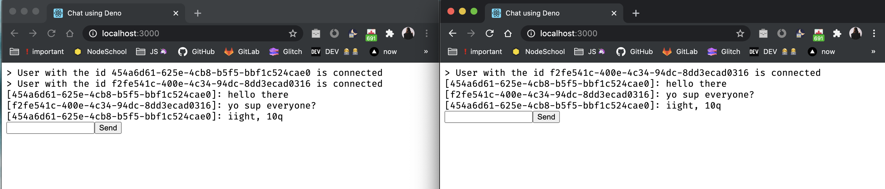

# Chat with Deno 🦕 + Preact

This is the code used in the article:

[Learn Deno: Chat App](https://aralroca.com/blog/learn-deno-chat-app)

Read the article to learn more about it.

## Getting started

`> git clone git@github.com:hellosophiee/chat-with-deno-and-preact.git`

`> cd chat-with-deno-and-preact`

`> deno run --allow-net --allow-read server.ts`